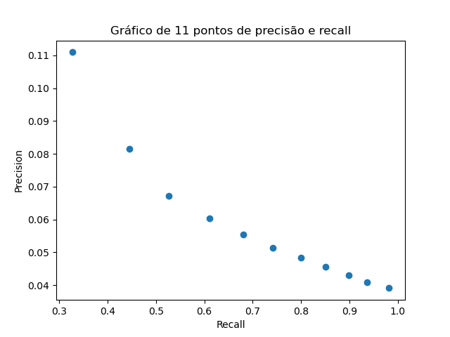
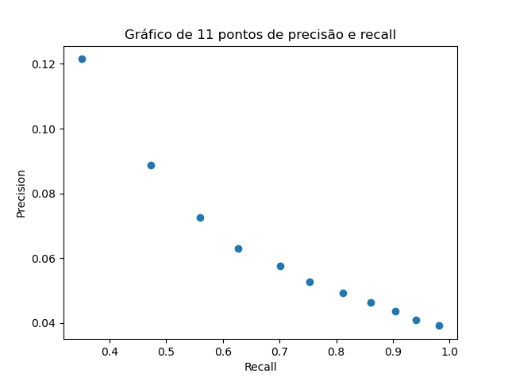
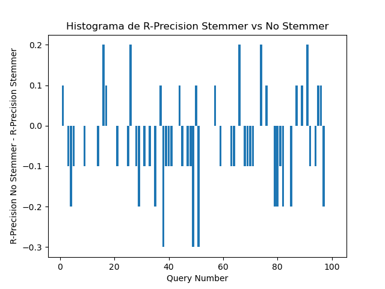

# Resultados

## Gráfico de 11 pontos de precisão e recall

#### No Stemmer

#### Stemmer

## F1

#### No Stemmer - 14.6%

#### Stemmer - 16.1%

## Precision@5

#### No Stemmer - 34.3%

#### Stemmer - 38.6%

## Precision@10

#### No Stemmer - 28.1%

#### Stemmer - 31.0%

## Histograma de R-Precision (comparativo)

## MAP

#### No Stemmer - 54.7%

#### Stemmer - 59.1%

## MRR

#### No Stemmer - 63.7%

#### Stemmer - 67.8%

## Discounted Cumulative Gain (médio)

#### No Stemmer - 2.81

#### Stemmer - 2.95

## Normalized Discounted Cumulative Gain

#### No Stemmer - 50.4%

#### Stemmer - 53.3%

